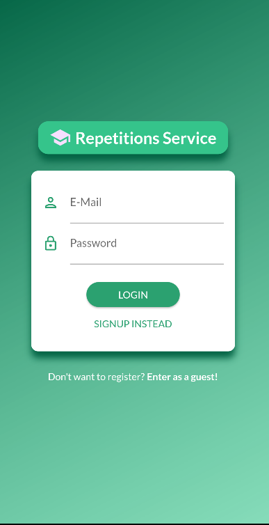
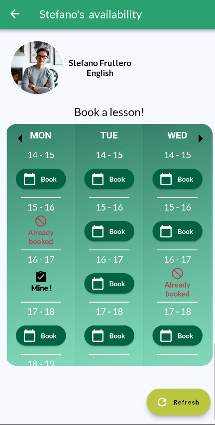
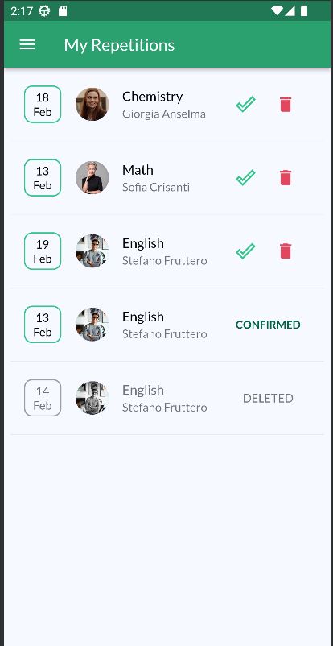

# RepetitionsPlatform

RepetitionsPlatform is a comprehensive Repetitions Service,  designed for educational purposes, built using various technologies:

- **Vue CLI**: for the Desktop Frontend (FE).
- **Flutter**: for the Mobile Frontend (FE).
- **Java Servlets**: for the Backend.
- **MySQL**: for the Database (DB).

## Vue UI

    
    
    
    

## Flutter UI

    
    
    
    

## Backend Overview
The RepetitionsPlatform backend consists of Data Access Object (DAO) classes and servlets. DAOs manage database interactions, handling operations like inserting, modifying, and retrieving data. Servlets process HTTP requests, executing business logic and generating responses. The backend interacts with a MySQL database, ensuring efficient data management. It enforces application-specific rules, validates input, and maintains data integrity.
